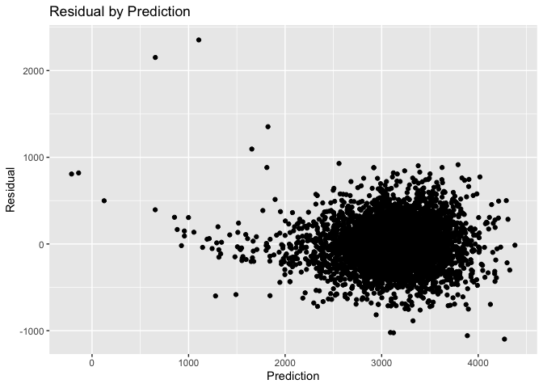
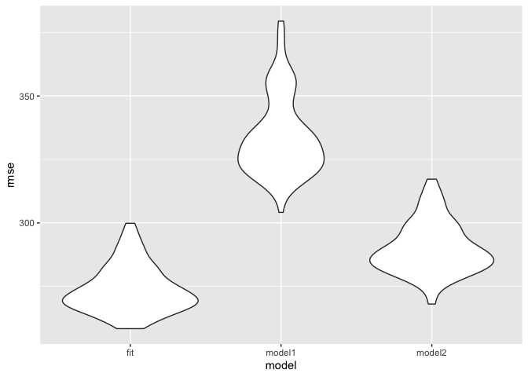

HW 6
================
Kelly Wang

## Problem 1

``` r
# load the data in
birthweight_data=
  read_csv(file= "./data/birthweight.csv") 
```

    ## Parsed with column specification:
    ## cols(
    ##   .default = col_double()
    ## )

    ## See spec(...) for full column specifications.

``` r
#tidy data
birthweight_tidy = 
  birthweight_data%>% 
  janitor::clean_names() %>% 
  drop_na() %>% 
  mutate(
    babysex=recode(babysex, '1'= 'male', '2'='female'),
    babysex=as.factor(babysex),
    babysex=fct_relevel(babysex,"male", "female"),
    bhead=as.numeric(bhead),
    blength=as.numeric(blength),
    bwt=as.numeric(bwt),
    delwt=as.numeric(delwt),
    fincome=as.numeric(fincome), 
    frace=recode(frace, '1'='White', '2'= 'Black', '3'='Asian', '4'='Puerto Rican', '8'='Other', '9'='Unknown'),
    frace=as.factor(frace),
    frace=fct_relevel(frace,"White", "Black", "Asian", "Puerto Rican", "Other", "unknown"),
    gaweeks=as.numeric(gaweeks),
    malform=recode(malform, '0' = "absent", '1' = "present"),
    malform=as.factor(malform),
    malform=fct_relevel(malform, "absent", "present"),
    menarche=as.numeric(menarche),
    mheight=as.numeric(mheight),
    momage=as.numeric(momage),
    mrace=recode(mrace,'1' = 'White', '2' = 'Black', '3' = 'Asian', '4' = 'Puerto Rican', ' 8' = 'Other'),
    mrace=as.factor(mrace),
    parity=as.numeric(parity), 
    pnumlbw=as.numeric(pnumlbw),
    pnumsga=as.numeric(pnumsga),
    ppbmi = as.numeric(ppbmi),
    ppwt=as.numeric(ppwt),
    smoken=as.numeric(smoken),
    wtgain=as.numeric(wtgain)
  )
```

    ## Warning: Unknown levels in `f`: unknown

#### Model Fitting

This is my model fitting process: 1. Tidy the data 2. Use a Stepwise
function to fit the model 3. Create the model 4. Test for
residuals/goodness of fit test 5. Comparing it to the other models

``` r
#set seed for reproducibility
set.seed(10)
#fit the full model

fit= lm(bwt ~ ., data=birthweight_tidy) %>% 
  stepAIC(direction="both", trace=FALSE)

#Variables selected: babysex, bhead, blength, delwt, fincome, gaweeks, mheight, mrace, parity, ppwt, smoken
a= fit %>% broom::glance()

##adjusted R^2 0.71725 --> pretty good!

b= fit %>% broom::tidy()

# Step 4. Running regression diagnostics
predictions =modelr::add_predictions(birthweight_tidy, fit)

residuals_plot=
  predictions %>% 
  modelr::add_residuals(fit) %>% 
  ggplot(aes(x=pred, y=resid)) + geom_point()+
  labs(x= "Prediction", y = "Residual", title="Residual by Prediction")

residuals_plot
```

<!-- -->

``` r
#Model 1
model1_lm=lm(bwt ~ blength + gaweeks, data=birthweight_tidy) %>% 
  broom::tidy()

#model 2:
model2_lm=lm(bwt~ bhead + blength + babysex + bhead*blength +bhead*babysex + blength*babysex + blength*babysex*bhead, data=birthweight_tidy ) %>% 
  broom::tidy()

##found out a shortcut during office hours to do this
model21_lm=lm(bwt~ bhead*blength*babysex, data=birthweight_tidy ) %>% 
  broom::tidy()

# ploting three models to see best model
cv_df=
  crossv_mc(birthweight_tidy, 100) %>% 
  mutate(
    train=map(train, as_tibble),
    test = map(test, as_tibble)
  )

cv_df=
  cv_df %>% 
  mutate(fit = map(train, ~lm(bwt ~ ., data=.x) %>% stepAIC(direction="both", trace=FALSE)),
        model1_lm= map(train, ~lm(bwt ~ blength + gaweeks, data=.x)),
        model2_lm=map(train, ~lm(bwt~ bhead + blength + babysex + bhead*blength +bhead*babysex + blength*babysex + blength*babysex*bhead, data=.x))) %>% 
  mutate(rmse_fit = map2_dbl(fit, test, ~rmse(model=.x, data=.y)),
         rmse_model1= map2_dbl(model1_lm, test, ~rmse(model=.x, data=.y)),
         rmse_model2= map2_dbl(model2_lm, test, ~rmse(model=.x, data=.y)))
```

``` r
cv_df %>% 
pivot_longer(
    rmse_fit:rmse_model2,
    names_to = "model", 
    values_to = "rmse",
    names_prefix = "rmse_") %>% 
  mutate(model = fct_inorder(model)) %>% 
  ggplot(aes(x = model, y = rmse)) + geom_violin()
```

<!-- -->
